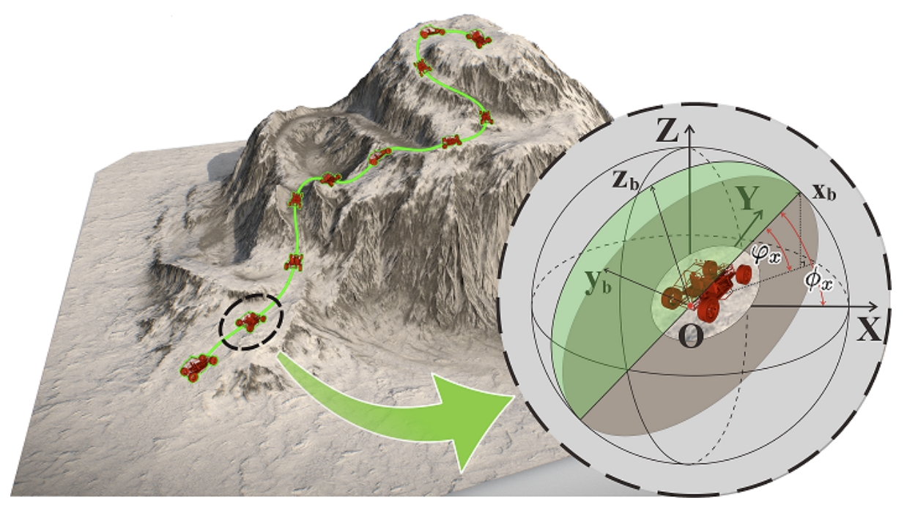
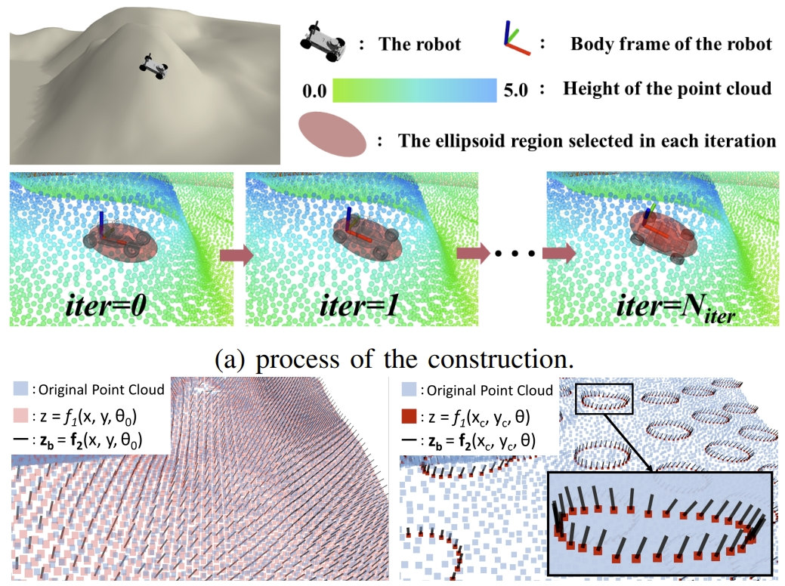
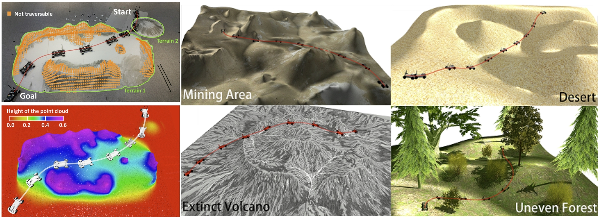
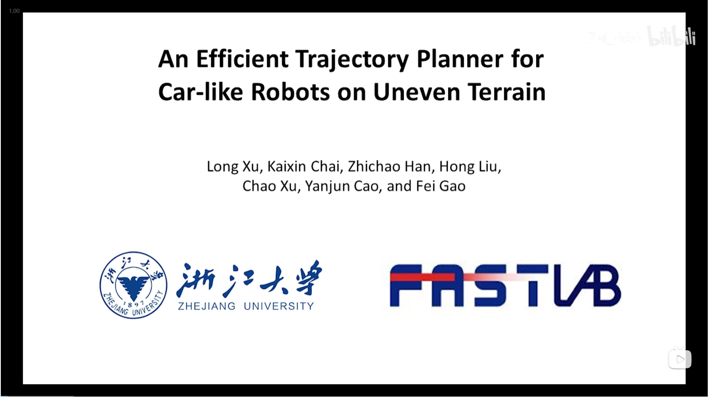

# An-Efficient-Trajectory-Planner-for-Car-like-Robots-on-Uneven-Terrain
Uneven terrain path planning. Accepted by IROS2023.
## Introduction
Autonomous navigation of ground robots on uneven terrain is being considered in more and more tasks. However, uneven terrain will bring two problems to motion planning: how to assess the traversability of the terrain and how to cope with the dynamics model of the robot associated with the terrain. The trajectories generated by existing methods are often too conservative or cannot be tracked well by the controller since the second problem is not well solved. In this paper, we propose terrain pose mapping to describe the impact of terrain on the robot. With this mapping, we can obtain the SE(3) state of the robot on uneven terrain for a given state in SE(2). Then, based on it, we present a trajectory optimization framework for car-like robots on uneven terrain that can consider both of the above problems. The trajectories generated by our method conform to the dynamics model of the system without being overly conservative and yet able to be tracked well by the controller. We perform simulations and real-world experiments to validate the efficiency and trajectory quality of our algorithm.

  
   
  <em>Figure 1: uneven terrain and car-like robot</em>

As shown in **Figure 1**, a car-like robot driving on uneven terrain, the green line indicates the trajectory optimized by the proposed method.

  
   
  <em>Figure 2: terrain analysis and its representation</em>

As shown in **Figure 2**, the Process and Results of Constructing Mapping F. Figure (a) illustrates the process of Algorithm 1, where the gray vehicles indicate the robot poses obtained in each iteration. Figures (b) and (c) show the different z and zb when θ or position (x, y) is fixed, respectively, where the blue points are the original point cloud. The heights of the red points in Figure (b) and Figure (c) indicate the height z ∈ R. The black line on each point indicates the zb ∈ S2 + with the direction pointing from the point to the sky. In Figure (c), black lines and red dot heights on each circle indicate zb and z respectively when the position is the center of the circle (xc, yc) but θ ∈ SO(2) is different. Here, zb may vary with θ at the same position (xc, yc), since the neighboring area of the robot may be rugged rather than a flat plane.

  
   
  <em>Figure 3: Experiment in real-world and simulation environment</em>

**Figure 3** illustrates the real world and simulation envrionment. In the real-world senario, Real-World Experiments: In this case, the car-like robot needs to go downhill and uphill twice, traverse two terrains, and avoid the not traversable area determined by conditions (36) and (37). The length of the planned trajectory in 3D space (the red curve) is 5.496m, planning time consuming is 1.603s. The bottom half of this figure shows the visualization in RViz. In the simulated senario, A car-like robot navigating autonomously through different uneven terrain.

## vedio
Click on the image below to watch the experimental video:

## preprint paper
The paper is accepted by IROS2023, which is under review now. Click [here](https://arxiv.org/pdf/2309.06115.pdf) to see the preprint version.
